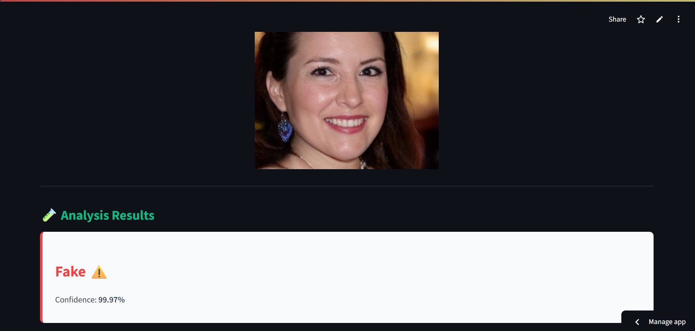
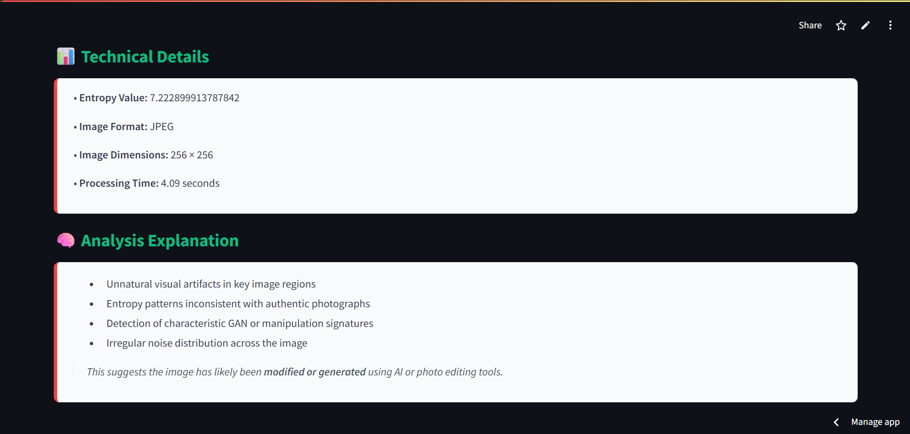
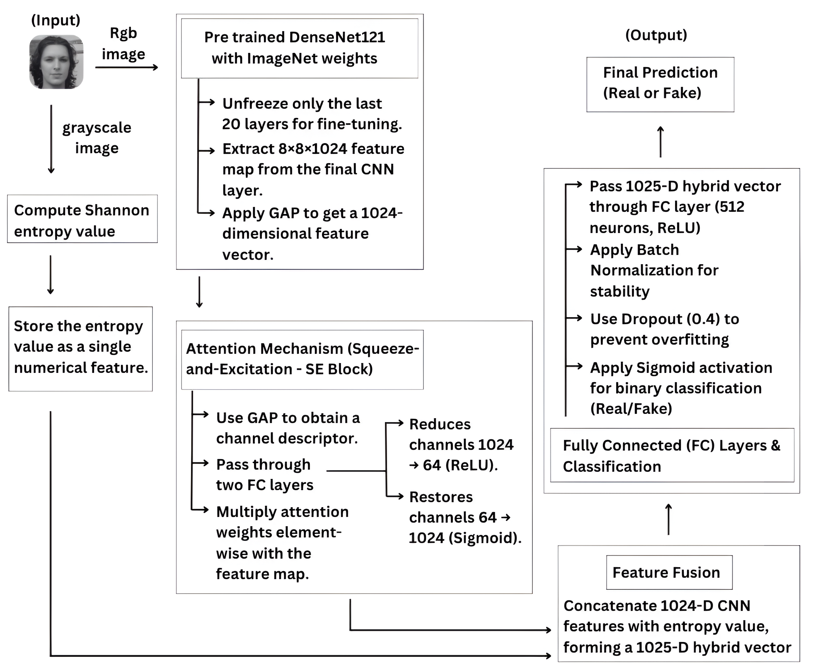
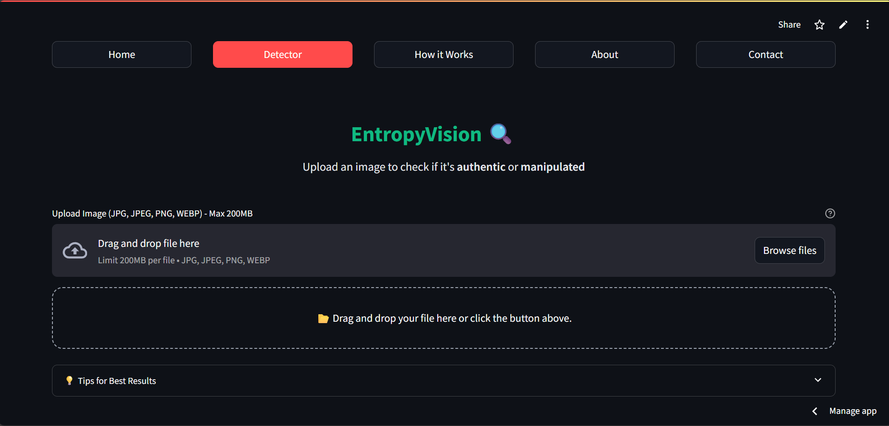
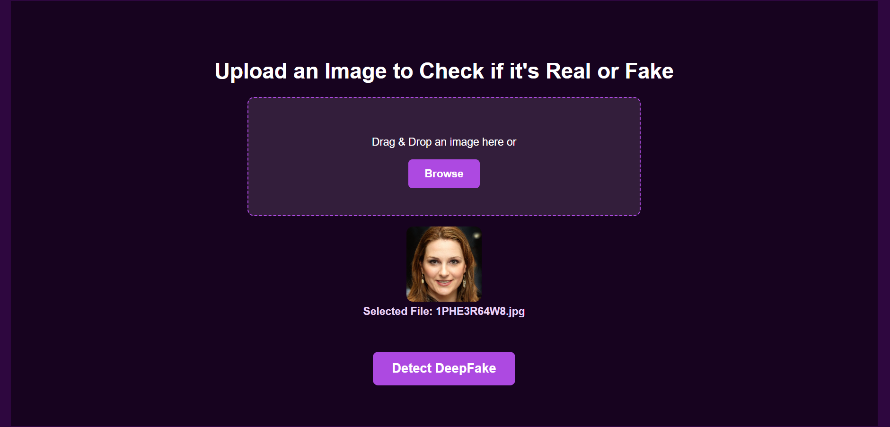
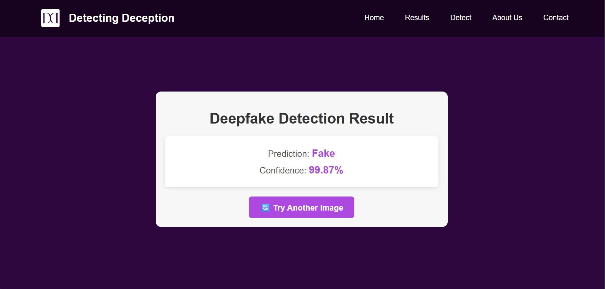

# A CNN and Entropy-Based Hybrid Model for Robust Deepfake Detection

<br>

**Live Demo:  [Click Here for Live Demo](https://entropyvision-ai.streamlit.app/)** <div id="top"></div>

<br>

## 📄 Overview

This project presents a novel hybrid deepfake detection model that integrates **Convolutional Neural Networks (CNNs)** with **entropy-based randomness analysis**. Designed to overcome the limitations of existing CNN-only models, especially against high-quality, fine-grained deepfakes, our approach significantly enhances classification reliability and reduces false positives.

Deepfake technology, while having legitimate uses in fields like education and entertainment, has been increasingly exploited for malicious activities such as **misinformation, identity fraud, blackmail, and online scams**. Traditional CNN-based detectors often struggle with advanced deepfakes due to their reliance solely on visual cues and their susceptibility to adversarial attacks. 

Our hybrid model addresses this by combining the robust spatial feature extraction capabilities of DenseNet-121 with the statistical regularities identified through Shannon entropy, capturing inconsistencies inherent in GAN-generated images.

---

<br>

## ✨ Key Features

* **Hybrid Architecture:** Fuses a fine-tuned **DenseNet-121 CNN** with **Shannon entropy** values for a richer, more comprehensive understanding of image authenticity.
* **Enhanced Robustness:** Significantly improves detection accuracy against sophisticated, high-resolution deepfakes generated by advanced models like StyleGAN.
* **Attention Mechanism:** Integrates a **Squeeze-and-Excitation (SE) attention block** to intelligently weight image channels, making sure the model focuses on the most informative features.
* **Exceptional Accuracy:** Achieves an impressive **99.41% accuracy** on the test set, outperforming conventional CNN-based models.
* **Reduced False Positives:** Dramatically lowers the number of times advanced deepfakes are mistakenly classified as real, a critical improvement for real-world reliability.
* **Extensive Dataset:** Trained and validated on a massive dataset of **140,000 high-resolution images**, including 70,000 real images from Flickr-Faces-HQ and 70,000 fake images generated by StyleGAN, ensuring robust learning.

---

<br>

## 🖼️ Visual Demonstration ('app2.py')

Here are some visuals showcasing the application's interface and capabilities:


<div style="display: flex; flex-wrap: wrap; justify-content: space-around; gap: 10px;">
  <div style="flex: 1 1 300px; max-width: 48%; text-align: center; border: 1px solid #eee; padding: 5px;">
    <br>
    <p><b>Streamlit App Interface</b></p>
    <br>
    
  </div>
  <hr style="border: none; background-color: #ccc; height: 0.1px; margin: 20px 0;">
  <div style="flex: 1 1 300px; max-width: 48%; text-align: center; border: 1px solid #eee; padding: 5px;">
    <br>
    <p><b>Upload Image</b></p>
    <br>
    
  </div>
  <hr style="border: none; background-color: #ccc; height: 0.1px; margin: 20px 0;">
  <div style="flex: 1 1 300px; max-width: 48%; text-align: center; border: 1px solid #eee; padding: 5px;">
    <br>
    <p><b>Prediction Details</b></p>
    <br>
    
  </div>
</div>


---

<br>

## 📊 Dataset

The model was trained and evaluated on a comprehensive dataset consisting of **140,000 high-resolution images**, meticulously divided into:
* **100,000 Training Images** (50,000 real, 50,000 fake)
* **20,000 Validation Images** (10,000 real, 10,000 fake)
* **20,000 Testing Images** (10,000 real, 10,000 fake)

The images are sourced as follows:
* **Real Images:** Acquired from the Flickr-Faces-HQ (FFHQ) dataset.
* **Fake Images:** Generated using the state-of-the-art StyleGAN model.

<br>

You can access the dataset used for this project on Kaggle here:
**[Deepfake Image Detection Dataset](https://www.kaggle.com/datasets/xhlulu/140k-real-and-fake-faces)**

---

<br>

## ⚙️ System Architecture & Logic Flow

To better understand how our hybrid deepfake detection model operates, the following diagram illustrate its overall system architecture and the flow of logic from image input to prediction.

<br>

<div style="display: flex; flex-wrap: wrap; justify-content: space-around; gap: 10px;">
    <div style="flex: 1 1 300px; max-width: 48%; text-align: center; border: 1px solid #eee; padding: 5px;">
        <div align="center">
          
        </div>    
    </div>
</div>

---

<br>

## 💻 Technologies Used

This project leverages a focused set of key technologies:

* **Python:** The foundational programming language.
* **TensorFlow & Keras:** For building and running the hybrid deep learning model (DenseNet-121).
* **Streamlit:** For the interactive web application interface (`app2.py`).
* **Flask:** For the alternative web interface (`app.py`).
* **NumPy:** Essential for high-performance numerical computing.
* **OpenCV (cv2) / Pillow:** For image processing and manipulation.
* **`gdown`:** Used for programmatic download of the large pre-trained model.
* **Jupyter Notebook:** For model development, training, and experimentation.

---

<br>

## 📂 Project Structure

All core files for this project are located in the root directory:

   ```bash
├── images/                  # Contains screenshots and visual assets used in this README.
│   ├── app2_image_prediction.png
│   ├── app2_interface.png
│   ├── app2_prediction_details.png
│   ├── app_image_prediction.png
│   ├── app_interface.png
│   ├── app_prediction_details.png
│   └── system_architecture_flow.png
├── static/                  # Static assets for the Flask web application (app.py).
│   ├── deepfake_hero.jpeg
│   ├── logo.png
│   ├── style.css
│   ├── style1.css
│   └── team.jpg
├── templates/               # HTML template files for the Flask web application (app.py).
│   ├── index.html
│   └── result.html
├── Hybrid model.ipynb       # Jupyter Notebook containing the complete model training, evaluation, and experimentation.
├── LICENSE                  # Specifies the legal terms under which the project can be used and distributed.
├── README.md                # This README file, providing a comprehensive overview and setup instructions for the project.
├── app.py                   # Flask Web Application: The backend logic for the HTML/CSS web interface.
├── app2.py                  # Streamlit Application: The main script for our interactive deepfake detection web interface.
└── requirements.txt         # Lists all Python dependencies required to run the project.
  ```

---

<br>

## 🚀 Getting Started

These instructions will give you a copy of the project up and running on
your local machine for development and testing purposes.

### Prerequisites

Requirements for the software and other tools to build, test and push 
- Python 3.8+ (preferably 3.11)

### Installation

1.  **Clone the Repository:**
   
    ```bash
    git clone https://github.com/dharambirsinghsidhu/EntropyVision_Deepfake_Detector.git
    cd EntropyVision_Deepfake_Detector
    ```

3.  **Create and Activate a Virtual Environment:**

    It's highly recommended to use a virtual environment to manage project dependencies.

    ```bash
    python -m venv venv
    ```

    * **On Windows:**
        ```bash
        .\venv\Scripts\activate
        ```
    * **On macOS/Linux:**
        ```bash
        source venv/bin/activate
        ```

4.  **Install Python Dependencies:**

    First, ensure your `pip` installer is up to date, then install the required Python libraries.

    ```bash
    pip install --upgrade pip
    pip install -r requirements.txt
    pip install streamlit
    ```

End with an example of getting some data out of the system or using it
for a little demo

---

<br>

## 📦 Model Download

Due to the substantial size of our pre-trained deepfake detection model, it is not directly included in this repository. Instead, the application is configured to **automatically download the model from Google Drive** the first time it's run, or if the model file is not found locally. This ensures a smoother setup while keeping the repository lightweight.

**How it works:**

When you run `app2.py`, it will check for the presence of the model file (e.g., in a `models/` directory). If it's missing, a download process will be initiated, typically displaying progress in your terminal. Please ensure you have an active internet connection during the first run. The model will be saved to a designated folder (e.g., `models/` or `weights/`) within your project directory for future use.

<br>

**Download Trained Model:  [Click Here to Download Pre-Trained Model](https://drive.google.com/file/d/1xlTb2ToE82F4wAzTAJxRIejW4lX8bMEy/view?usp=drive_link)** <div id="top"></div>

---

<br>

## ▶️ Running the Application

Once everything is installed, starting the app is simple:

1.  Go to your project's main folder in your terminal.
2.  Type this command and press Enter:
    ```bash
    streamlit run app2.py --server.enableCORS false --server.enableXsrfProtection false
    ```
3.  A new tab will automatically open in your web browser showing the application, usually at `http://localhost:8501`.

---

<br>

## 💡 Using the Deepfake Detector (EntropyVision)

Our tool is designed for easy deepfake detection:

1.  Start the Streamlit application in your browser.
2.  **Upload any image** you want to verify.
3.  The system will process it and show you whether it's **real or a deepfake**, complete with a **confidence level**.

---

<br>

## 🤝 Contributing

We warmly welcome contributions to this project! If you're interested in improving the model, enhancing the user interface, or adding new functionalities, please follow these general steps:

1.  Fork the repository.
2.  Create a new branch for your feature (`git checkout -b feature/YourAwesomeFeature`).
3.  Commit your changes (`git commit -m 'Add a new feature'`).
4.  Push to your branch (`git push origin feature/YourAwesomeFeature`).
5.  Open a Pull Request, describing your changes in detail.

Please make sure your code adheres to good practices and includes relevant tests if applicable.

---

<br>

## 📧 Contact

For any questions or collaborations, feel free to reach out to the project maintainer:

* **Dharambir Singh Sidhu:** dharambirsinghsidhu.work@gmail.com

<br>

---
---

<br>

## 📚 Appendix: Alternative Web Interface (`app.py`)

In addition to the Streamlit application, this project also includes an alternative web interface built with HTML/CSS and potentially powered by Flask (`app.py`). This interface offers a different approach to interacting with the deepfake detection model, showcasing flexibility in deployment options.

<br>

## 💡 How to Run the HTML/CSS Interface

1.  **Ensure you have activated your virtual environment** (as described in "Local Setup and Installation").
   
2.  **Navigate to your project's root directory** in the terminal.
   
3.  **Install Python Dependencies:**

    First, ensure your `pip` installer is up to date, then install the required Python libraries.

    ```bash
    pip install --upgrade pip
    pip install -r requirements.txt
    ```
    
4.  **Run the Flask application:**
    ```bash
    python app.py
    ```
7.  The application should then be accessible in your web browser, typically at `http://127.0.0.1:5000/` or a similar local address indicated in your terminal.

---

<br>

### 📸 Visual Demonstration ('app.py')

<div style="display: flex; flex-wrap: wrap; justify-content: space-around; gap: 10px;">
  <div style="flex: 1 1 300px; max-width: 48%; text-align: center; border: 1px solid #eee; padding: 5px;">
    <br>
    <p><b>Web App Interface</b></p>
    <br>
    
  </div>
  <hr style="border: none; background-color: #ccc; height: 0.1px; margin: 20px 0;">
  <div style="flex: 1 1 300px; max-width: 48%; text-align: center; border: 1px solid #eee; padding: 5px;">
    <br>
    <p><b>Upload Image</b></p>
    <br>
    
  </div>
  <hr style="border: none; background-color: #ccc; height: 0.1px; margin: 20px 0;">
  <div style="flex: 1 1 300px; max-width: 48%; text-align: center; border: 1px solid #eee; padding: 5px;">
    <br>
    <p><b>Prediction Details</b></p>
    <br>
    
  </div>
</div>

---

<br>

<div style="display: flex; flex-wrap: wrap; justify-content: space-around; gap: 10px;">
    <div style="flex: 1 1 300px; max-width: 48%; text-align: center; border: 1px solid #eee; padding: 5px;">
        <div align="center">
              <div>© 2025 Dharambir Singh Sidhu. Licensed under the <a href="./LICENSE">MIT License</a>.</div>
          <br>
          🔹<a href="#top"> Back to Top </a>🔹
        </div>    
    </div>
</div>

<br>

---
